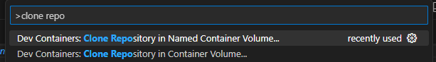

# Devcontainer for Fusion

This devcontainer allow you to develop Fusion using VSCode, in a container.

## Set up dev container

You can run the dev container remotely on Github CodeSpaces (option A), or locally in Docker Desktop or Podman (option B).

### A. Github Codespaces

Click this link to open this repository in a codespace:

If you do not have access to Github Codespaces, reach out on the

Alternatively, in a new VSCode session start the devcontainer from the command palette with `Remote-Containers: Open Repository in Container...` and select the cognitedata/fusion repository.
Or from the github web UI, select the `main` (or other) branch and click on the green button. Choose `Codespaces` and then the `+` sign (or ... to change the default configurations for the instance). The instance should have at last 4 cores (and with 16 GB RAM, 32 GB disk)

### B. Local Docker desktop / Podman

This option is to run the development environment fully locally, with VSCode running locally on your host OS, but the Fusion code cloned and running in a container.

To run this devcontainer in Docker locally, you need to have [Docker Desktop](https://www.docker.com/products/docker-desktop/) installed and running.

Another alternative is to use [Podman](https://podman.io/).

Make sure docker or podman is running.

You also need to have the `Remote - Containers` extension installed in your local VSCode installation. This is included in the `Remote Development` extension pack, which is recommended, and should be installed by default in an up-to-date VSCode installation.

Note: For best performance (especially on Windows with WSL2), you should clone the fusion repository inside a docker volume. In the VSCode palette (Ctrl+Shift+P), search for "clone repo", which should show "Dev Containers: Clone Repository in Named Container Volume". Select that.

Click through the clone repo steps in the command palette, and search for the `cognitedata/fusion` repository in the repository search step. Name the container volume for the cloned repository something sensible. Then let the devcontainer initialize and start.

## After devcontainer has started

To be able to run yarn, you need to log in to the Cognite npm organization.
Open a terminal in the VSCode session (Ctrl+Shift+`), and run:

> npm login

The npm login command will show a link to a web page where you can log in with your Cognite account. Click the link, and allow VSCode to open it in your host OS browser. After logging in (preferably with 2FA), you can close the browser tab and return to the terminal in VSCode. When runnning VSCode in a non-UI environment, such as in Codespaces, do not press enter to have npm login command try open the link in the local browser. Alternatively, you can copy the link and open it in a browser manually.

You can then follow the [main Fusion repository README.md](https://github.com/cognitedata/fusion#readme) to build and run Fusion apps, using `yarn` and `nx` commands.

Note that the `nx` component and `gh` (github cli) are already installed in the devcontainer, so you can skip any advice to install them.
