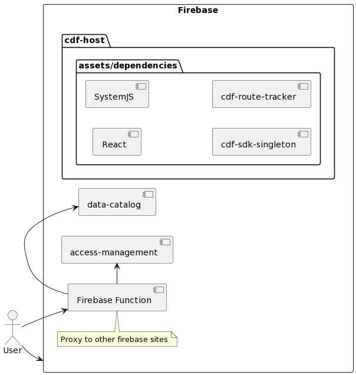

# fusion-shell



This repository is the entry point for the CDF (Cognite Data Fusion) front-end.

**Short summary**
It's a microfrontend hybrid architecture that uses [Single SPA](https://github.com/single-spa/single-spa) and [Module Federation](https://webpack.js.org/concepts/module-federation/).

The `SingleSPA` part is to support loading older/legacy sub-apps and `Module Federation` to load the new updated sub-apps.

It's basically a "shell" for managing the rest of the front-ends we call sub-applications.
Having them separate means we can develop these sub-applications in isolation.

`SingleSPA` is a framework for developing micro-frontends. It uses SystemJS to load and bundle sub-apps, usually requires custom webpack config to get things running.
`Module Federation` is a concept based on software modularity. It involves the division of software into smaller, independent modules that can be connected together to create powerful, scalable applications.

The idea is to devide the app into smaller sub-apps and be able to build, deploy and load them individually.

# Development

A good starting point to understand how the current solution works is to read the architecture document on Confluence.

You can read more here:
https://cognitedata.atlassian.net/wiki/spaces/CE/pages/3613917310/Fusion+as+a+unified+Platform+UI

## Working on the host application

If you need to work on a part of the app that is using single-spa, here are the most important files for single-spa:

- `src/app/single-spa` - folder that contains everything related for single-spa
- `src/apps-manifest.json` - JSON file that contains information about all sub-apps, routes and the type of app.
- `src/import-map.json` - JSON file that contains import map for core libs like react, sdk-singleton...etc.
- `src/sub-apps-import-map.json` - JSON file that contains import map for sub-apps. This is a manifest file, the actual file is generated on compile time/on fly. It points to a virtual file paths that are resolved by a proxy server.

### Where can I find the configs from cdf-hub in fusion-shell?

For fusion-shell, we combined several apps into one (navigation, root-config, root-page...etc.).

**To add a new sub-app**
Now everything is on one place, just edit `apps-manifest.json` file and append/edit your app.

For example:

```JSON
{
  "key": "cdf-vision-subapp",
  "appName": "@cognite/cdf-vision-subapp",
  "appType": "single-spa",
  "hosting": {
    "staging": "https://cdf-vision-staging.web.app",
    "preview": "https://cdf-vision-preview.web.app",
    "production": "https://cdf-vision-prod.web.app"
  },
  "routes": [
    {
      "route": "/:tenantName/vision"
    }
  ]
}
```

**key** - your app name key, used for registering your app, naming folders...etc.
**appName** - your app name/package name or previously `resolveToKey` that is used to reference and load the app on runtime
**appType** - should be either `single-spa` or `module-federation`
**hosting** - control for which env you will load which app. Example for single branch strategy it will always point to `prod`
**routes** - register the routes you want to use to load your app.

### Build host app

Run `nx run fusion-shell:build:<configuraion-target>` ex `nx run fusion-shell:build:staging`.

The build command for the host app includes several custom steps:

- `build` command is called, which calls `internal-build`, `build cdf-sdk-singleton` as SystemJS package and `fusion-post-build.sh` which does post-build processing
- `internal-build` does the regular app build using the webpack config and sets public path and assets path depending if the build is for fusion or cdf
- `fusion-post-build.sh` copies the build from sdk-singleton, route-tracker..etc into the `dist/apps/fusion-shell/assets/dependencies/@cognite` folder. Those are SystemJS libs needed for SingleSPA stuff
  - Additionally, it generates updated `import-map.json` and `sub-apps-import-map.json` files with the corect paths

## Working on sub-apps

Each sub-app is going to be different and it really depends if the sub-app uses single-spa or module federation.

### Building a subapp with Create React App

- With rescripts we can adjust the webpack config slightly to support the output to match single-spa

Example:
[DEMO REPO](https://github.com/cognitedata/unified-cdf-ui-demo-app)

### How to test or preview your sub-app

[Youtube guide](https://www.youtube.com/watch?v=vjjcuIxqIzY&list=PLLUD8RtHvsAOhtHnyGx57EYXoaNsxGrTU&index=4)

1. Use https://dev.fusion.cogniteapp.com/
2. Open devtools
3. In the console type: `importMapOverrides.enableUI()` (This sets some variables in localstorage)
4. On the bottom right click the "{...}"-button
5. Select your micro-frontend that you want to override.
6. Type in "https://localhost:3000/<your-micro-frontend-js-bundle.name>.js
7. Refresh the browser

Enjoy!

# Running and testing app locally

## Serving the host app

To serve the host app, just run `nx serve fusion-shell --configuration=<desired-config>`.
This will run the app completley in isolation and will proxy the API calls to mock server.

You can also serve the app against mock environment.

1. Start the mock server `nx serve mock-server`
2. Start the app using mock env `nx serve fusion-shell --configuration=mock`
3. Navigate to `http://localhost:8080/platypus?cluster=greenfield.cognitedata.com&organization=cog-appdev`

**Caveats**
When running serve command, it will use `cog-appdev` org as default. Additionally, because the login app is not in the monorepo it is pulled from production (cog-demo.fusion.com) and it is missing some of the images as well as you will get an error from React about missing cluster info. This is fine, just close the error and you should be able to login. We will fix this soon and get rid of `_api/login_info` call which will enable us to run the app everywhere.

## Serving the build

If you want preview and test the build from `staging, preview, prod` environments

1. Build the app `nx build fusion-shell --configuration=staging`
2. Run `nx run fusion-shell:serve-static:staging` - this will build the app first and then run local server
3. Navigate to `http://localhost:8080/platypus?cluster=greenfield.cognitedata.com&organization=cog-appdev`

**Caveats**
When serving the static files, it will use `cog-appdev` org as default.
Additionally, because the login app is not in the monorepo it is pulled from production (cog-demo.fusion.com) and it is missing some of the images as well as you will get an error from React about missing cluster info. This is fine, just close the error and you should be able to login.

If you want to test with another org, pass additional arg.
Here is an example how to do that

`nx run fusion-shell:serve-static:staging --args='--configuration=staging --organization=cog-demo'`

Here is the code where this is being assigned.
`apps/fusion-shell/tools/static-file-server.js`

# Deployments

## Environments

We are supporting fusion and unified sign-in environments.

**Fusion environments**

| Env Name     | Env file location                                                                    | URL                                                                 |
| ------------ | ------------------------------------------------------------------------------------ | ------------------------------------------------------------------- |
| dev          | `apps/fusion-shell/src/environments/fusion/dev/environment.dev.ts`                   | [dev.fusion.cogniteapp.com](https://dev.fusion.cogniteapp.com)      |
| next-release | `apps/fusion-shell/src/environments/fusion/next-release/environment.next-release.ts` | [next-release.cognite.com](https://next-release.fusion.cognite.com) |
| staging      | `apps/fusion-shell/src/environments/fusion/next-release/environment.next-release.ts` | [staging.fusion.cognite.com](https://staging.fusion.cognite.com)    |
| production   | `apps/fusion-shell/src/environments/fusion/production/environment.prod.ts`           | [fusion.cognite.com](https://fusion.cognite.com)                    |
|              |

## Sub-Applications

- [cdf-ui-extractor-downloads](/apps/extractor-downloads)
- [cdf-ui-raw-explorer](/apps/raw-explorer)
- [cdf-ui-transformations](/apps/transformations)
- [cdf-ui-3d-management](/apps/3d-management)
- [cdf-ui-extraction-pipelines](https://github.com/cognitedata/cdf-ui-extraction-pipelines)
- [cdf-ui-entity-matching](/apps/extraction-pipelines)
- [cdf-ui-interactive-diagrams](/apps/interactive-diagrams)
- [cdf-ui-vision](/apps/vision)
- [cdf-ui-document-search](/apps/cdf-document-search)
- [cdf-ui-data-exploration](/apps/data-exploration)
- [platypus](/apps/platypus)
- [cdf-ui-templates](https://github.com/cognitedata/cdf-ui-templates)
- [cdf-ui-functions](/apps/functions-ui)
- [cdf-ui-charts](/apps/charts)
- [cdf-ui-access-management](/apps/access-management)
- [cdf-ui-data-catalog](/apps/data-catalog)
- [cdf-ui-onboard-infield](https://github.com/cognitedata/cdf-ui-onboard-infield)
- [cdf-ui-dashboard-sessions](https://github.com/cognitedata/cdf-ui-dashboard-sessions)

## How to deploy your micro frontend

Each sub-app will be bundled with webpack and should be uploaded to firebase.
The map can be found in the Jenkins file on root.

### Revert a deployment

The host app uses virtual paths to resolve the sub-app files. They are served directly from Firebase.
To revert, go to firebase console and revert the deployment directly from there.

# E2E tests

E2E tests are running on CI where we have the clientId and clientSecret as repository secrets available so that we can get access token.
The token is fetched before cypress tests are started and is valid for the whole session. The code is here:
`apps/fusion-shell/cypress.config.ts`

After we get the access token, we are injecting a global function (testAuthOverrides) to the window object. This function later is used by the `cdf-sdk-sigleton` and it is returning the token mentioned from above.
The code for that is here:
`apps/fusion-shell/cypress/support/injectToken.ts`

Finally, on the application side, the app is running with `mock` environemnt, which is not using the AuthWrapper that does the authentication, but rather the one from `apps/fusion-shell/src/environments/mock/AuthContainer.tsx`.
Here, we are skipping the login screen and simulating that the user is authenticated. Under the hood it uses the `window.testAuthOverrides` mentioned above and is initializing the CogniteSdk client.

If you want to run cypress test locally, or run mock env with mocked access token, you will need to generate clientId/ClientSecret.

Get the clientId/ClientSecret from `cog-dss` (data science team, ask someone from data-exploration to send you an invite). use [this guide](../platypus-cdf-cli/LOGIN.md) to create clientId/ClientSecret

After this step, you can run cypress. This is the command that is executed on CI
`PROJECT=dss-dev TENANT=dssbycognite.onmicrosoft.com CLUSTER=greenfield DATA_EXPLORER_CLIENT_ID=<your-client-id> DATA_EXPLORER_CLIENT_SECRET=<your-client-secret> USE_MOCK_API=false yarn nx run fusion-shell:e2e:e2e --watch`

If you want to debug and run fusion-shell using `mock` env with your clientId/ClientSecret, do the following:

- run cypress using the command above and console log the token [here](apps/fusion-shell/cypress.config.ts)
- Modify `bootstrap.tsx` and add the following code

```ts
window.testAuthOverrides = {
  getToken: async () => {
    return '<the-access-token-from-console-log>';
  },
};

window.localStorage.setItem(
  '@cognite/auth-react/login-hints',
  '{"organization":"cog-appdev","idpInternalId":"a5bc6507-2644-4004-87eb-efdb3124e3e2","cluster":"greenfield.cognitedata.com","project":"platypus"}'
);
```

Finally run mock-server and fusion-shell

- `nx serve mock-server`
- `PROJECT=dss-dev TENANT=dssbycognite.onmicrosoft.com CLUSTER=greenfield DATA_EXPLORER_CLIENT_ID=<your-client-id> DATA_EXPLORER_CLIENT_SECRET=<your-client-secret> USE_MOCK_API=false yarn nx run fusion-shell:serve:e2e`
