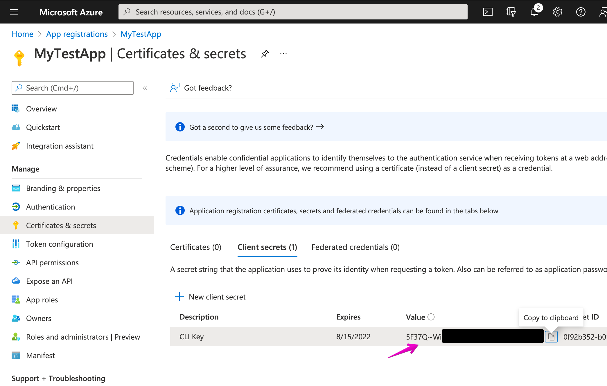

# Authentication with CLI

We rely on CDF Auth flow to authenticate user to the Platypus app namely (UI and CLI) so this document aims to make the journey for the end user easy.

## Overview

We namely support these login methods:

- Interactive Login - PKCE (for normal users)
- Device Code (for normal users on machines without browsers)
- Client Secret / Machine Tokens (for Machines)
- API-KEY or Legacy (_not recommended_)

## Interactive Login - PKCE

`yarn login` will take you through login flow with a browser popup. This is ideal for users logging in on a normal device with a internet browser (like Chrome, Edge, Safari, Firefox etc.).

- For users on devices without a internet browser who wants to log in as themselves (non-machine), check out the Device Code flow.
- For machine oriented login flow, take a look at the Client Credentials flow.

This would work automatically if an admin has already consented for the CLI to access your Azure AD tenant. More on this in the next section.

## Device Code (Interactive login on clients without browser)

`yarn login --authType=deviceCode` will take you through login flow like the normal interactive PKCE login, but without the popup. This is ideal for users on devices without a internet browser and if the user would like to still log in with their own credentials. For logging in as a machine (non-user), take a look at the next option - Client Credentials.

This would work automatically if an admin has already consented for the CLI to access your Azure AD tenant, just like the previous interactive PKCE option

### Enabling the CLI for your Azure AD tenant for PKCE or Device Code flow.

An admin would need to first approve the application. If you are an admin, and is trying to this, be sure to click the "Consent on behalf of your organisation" when you log in for the first time

If you login and see a screen like this, then it would mean you need to contact an admin to grant "admin consent" to the cdf-cli to the Azure AD tenant. Otherwise, you should be good to go!

If you failed to do so the first time, go through this URL
`https://login.microsoftonline.com/<tenant like xxx.onmicrosoft.com>/adminconsent?client_id=https://staging.platypus.<cluster>.cogniteapp.com`.

Or, use the UI in Azure AD Portal.

#### FAQ for PKCE or Device Code flow

> Something went wrong: invalid_client, description: AADSTS650052: The app needs access to a service ('api://XXXXXX') that your organization 'XXXXX' has not subscribed to or enabled. Contact your IT Admin to review the configuration of your service subscriptions.

This would mean that the CLI is aiming to access CDF (api://XXXXXX) which your tenant has not yet installed. Are you sure if the Azure AD tenant is connected to a CDF project? Additionally, have you enabled your Azure AD tenant against the CDF cluster?

This could be done if you are the Azure AD tenant's admin and visiting: `https://login.microsoftonline.com/<tenant like xxx.onmicrosoft.com>/adminconsent?client_id=https://<cluster>.cognitedata.com`. More details in the [official CDF documentation](https://docs.cognite.com/cdf/access/guides/configure_cdf_azure_oidc.html#step-1-1-permit-the-cognite-api-to-access-user-profiles-in-azure-ad).

## Client Credential / Machine Token

[This](https://docs.microsoft.com/en-us/azure/active-directory/develop/v2-oauth2-client-creds-grant-flow) mode is designed for long lasting token where you will need to provide `client_id` and `client_secret` for your application, this kind of token are long lasting and meant for machine interactions like CI/CD. In this case, the machine token is granted via an app registration, and the app would have to be granted access

`cdf login [project_name] --auth-type=clientSecret --client-secret=<client-secret> --client-id=<client-id>`

## How do you create your own Client Secret

In here we will see how can we create our own app registration to get a Client Secret, and then use that Client Secret to authenticate with the CLI to your Cognite Project.

1. Go to the Active Directory for the Cognite Project you want access to (in http://portal.azure.com/)
2. Click `Add` and select `App registration`.

   

   OR

   

3. Provide some `Name`, select either single or multi-tenant for `Account type` (For example: _Accounts in any organizational directory (Any Azure AD directory - Multitenant)_) and provide `http://localhost`(or any URL) as one of your redirect URL, this will not affect anything.

   

4. The newly created app registration's "Application ID" is the `client-id` for logging into CDF via CLI.

   

5. Now you can obtain your Client Secret by going inside the App's `Certificates & secrets` tab and create a new "Client Secret"

   

6. This new Client Secret token is the `client-secret` for logging into CDF via CLI.

   

7. Next go to `Groups` under Azure Active Directory and add the newly created app registration to Azure AD Groups that grants permissions to access data in CDF. For more information on how Groups in Azure AD is linked to Groups in CDF, check [official CDF documentation](https://docs.cognite.com/cdf/access/guides/create_groups_oidc.html)

   

#### FAQ for Client Secret flow

> I am getting `code: 401` errors

Please make sure you have `client-id` recorded down from step 4. and `client-secret` for step 6. Make sure both are passed into the CLI as parameters.

> I am getting `code: 403` errors

Please make sure you have added your app registration to the correct groups for permissions against CDF in step 7. For more information, check [official CDF documentation](https://docs.cognite.com/cdf/access/guides/create_groups_oidc.html)

> I am getting another strange error

Please reach out in [Cognite Hub](https://hub.cognite.com) or `#topic-templates` in slack!

## **Legacy Auth** is supported (but not-recomended), to use legacy auth with `API_KEY` please use the following command

`cdf login [project_name] --auth-type=legacy --api-key=<api_key>`

alternatively you can also use

`API_KEY=<api_key> cdf login [project_name] --auth-type=legacy`

> by default `[project_name]` is set to `platypus`
