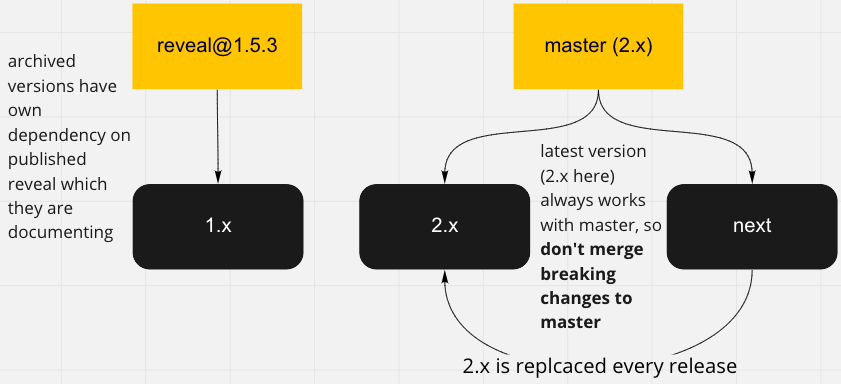

# Website

This [documentation website](https://cognitedata.github.io/reveal-docs/docs/) is built using [Docusaurus 2](https://v2.docusaurus.io/), a modern static website generator.

### Installation

```
$ yarn
```

### Local Development

```
$ yarn start
```

This command starts a local development server and open up a browser window. Most changes are reflected live without having to restart the server.

#### .env file

See `.env.example` to override project or model ids for local development. You need to copy it as `.env` file. It won't be commited.

### Build

```
$ yarn build
```

This command generates static content into the `build` directory and can be served using any static contents hosting service.

### Versioning



We have several versions of our documentation for different reveal versions. We always have at least:

* `next` (`/docs` folder) – your main place to create documentation for new features. 
    Write docs well before release, and you won't need to edit other sections ever.
* `2.x` or latest (`/versioned_docs/version-2.x/` folder). 
  On the website this is default documentation section for users because it describes
  the latest reveal version that published to NPM. Edit the latest version only when you want
  to apply some hotfix to documentation of the release that already published.
  **You must also apply the same fix to `next` version**
  because `/versioned_docs/version-2.x/` is completely replaced by `next` on every release.  
* `1.x` or other archived versions. They must be created on each major release. 
  You need to edit those only when you want to clarify docs for older published reveal versions
  that are not actively maintained anymore.

We typically don't version minor versions. Instead, mark every new feature with comment like:

```
> **New in 2.1.0**
```

For API reference use `@version` tag in jsdoc. For example:

```js
/**
  * Sets transformation matrix of the model.
  * @param transformationMatrix
  * @version Added in 2.1.0
  */
```

#### How to create new docs version?

Let's say you want to roll out new reveal@10.0.0, that what needs to be done:

* create new 10.x section
* make it default for docs website 
* tweak copying of next version to replace your 10.x with updates on every release
* introduce a new versioned dependency on reveal in your archived version

##### Create new 10.x section

Feel free to read docusaurus [versioning guide](https://docusaurus.io/docs/2.0.0-beta.0/versioning) 
for the version of docusaurus you currently use, but basic usage is covered below.

Basically you need to copy the whole content of your `next` version under `versioned_docs`.

That's already handled by `yarn run replace-latest` script, but you for new version you need to adjust version name in that script. 
So, go to `package.json` and do that change at `replace-latest` script

```diff
- "replace-latest": "yarn apiref && rimraf versioned_sidebars versioned_docs versions.json && yarn docusaurus docs:version 9.x"
+ "replace-latest": "yarn apiref && rimraf versioned_sidebars versioned_docs versions.json && yarn docusaurus docs:version 10.x"
```

That script is also used during release process of reveal to replace default docs section with the contents of `next`.

### Deployment

We deploy docs automatically for every merge into master.  

* `2.x`
* `1.x` version is default. 
    There should be only documentation for the published versions of `@cognite/reveal`.
    Files for `1.x` are in `/versioned_docs/version-1.x`. **You shouldn't edit these files** unless you want to publish some fix ASAP.
    In that case you need to apply the fix for the both `next` and `1.x` versions.
* `next` contains docs for the latest unpublished `@cognite/reveal` (master branch). 
    You should always edit files for the next version only (they are stored in `/docs` folder).
    Files for `1.x` version are replaced with files from `/docs` for every release. It's handled inside viewer `bump` script.
    
When you write documentation for new features please specify from which version feature is available.
Use the following comment:

```
> **New in 1.1.0**
```

> **New in 1.1.0**

For API reference use `@version` tag in jsdoc. For example:

```js
/**
  * Sets transformation matrix of the model.
  * @param transformationMatrix
  * @version Added in 2.1.0
  */
```

The `@version` tag is used to indicate changed functionality between minor versions within the same
major release, e.g. if a function `clear()` is added in 2.1.0 it's marked with `@version New in 2.1.0`.
When releasing the next major version (e.g. version 3.0.0), the `@version` tags are removed since
the functionality will be available for all version 3 releases.
