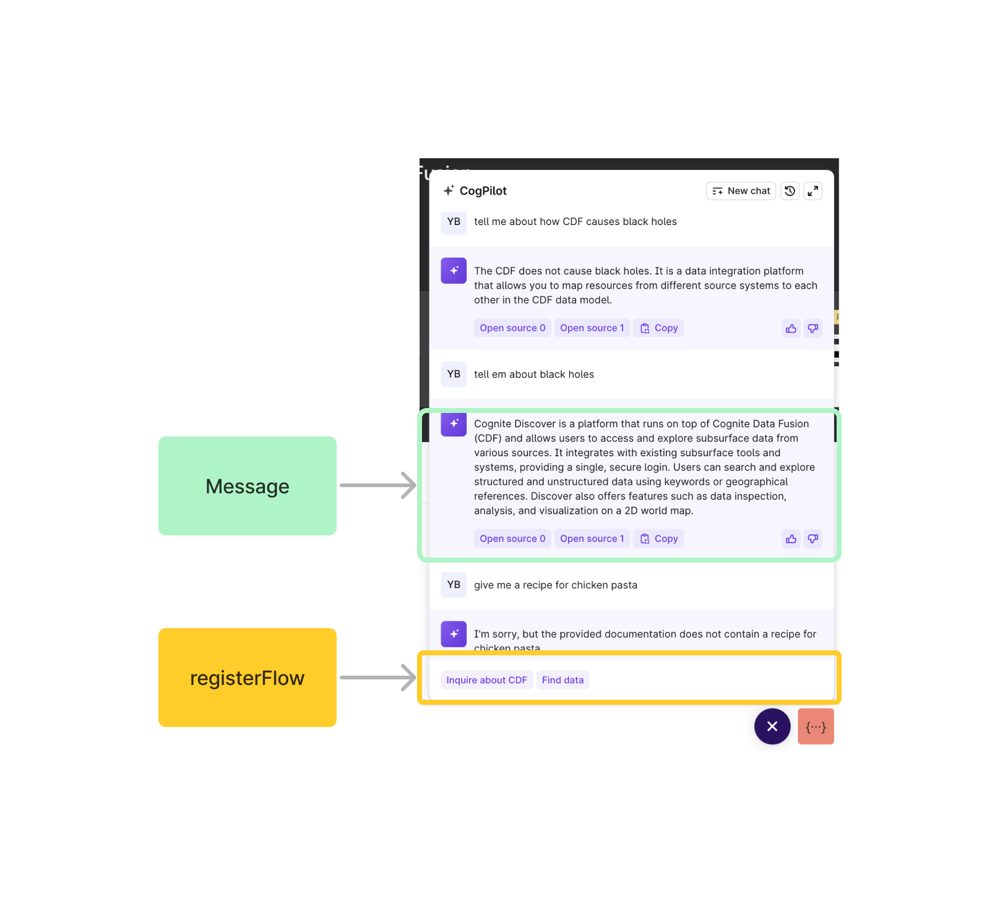
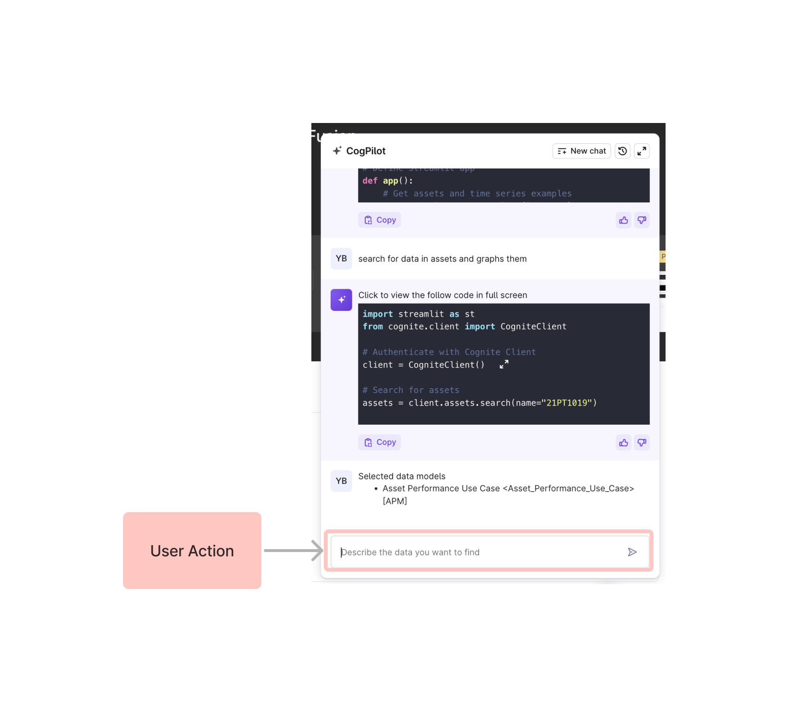
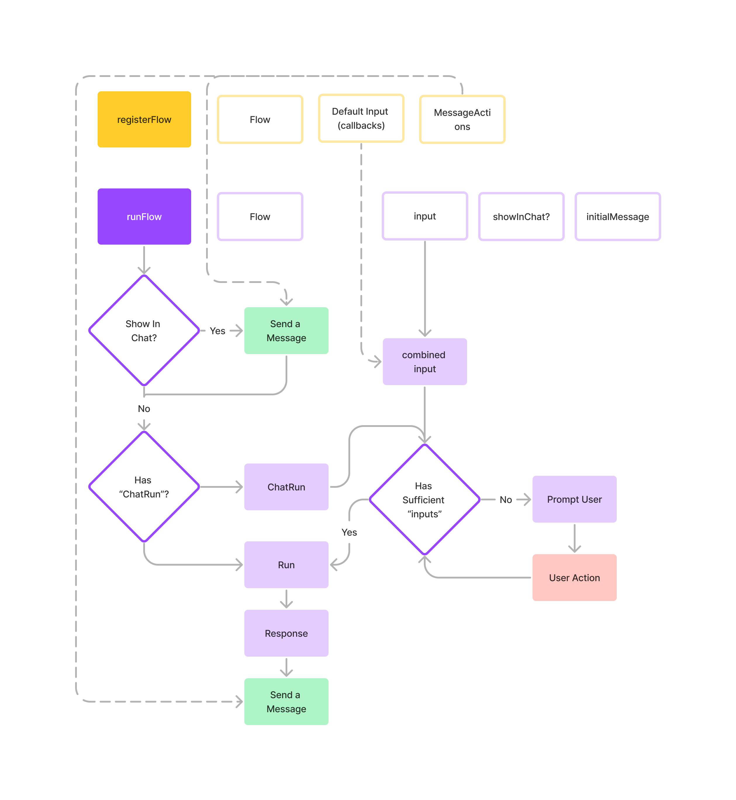

# @cognite/copilot-core

This is the core library for the Copilot. It contains the UI for the chatbot, and acts as a thin wrapper above the Chains from `@cognite/llm-hub`.

## Getting started

1. Install the library

```bash
yarn add @cognite/copilot-core
# if your in `fusion` repo already, you can skip this,
# '@fusion/copilot-core' is already avaialble to you
```

2. import the `Copilot` component from the library and mount it. It expects a valid `sdk` (CogniteClient).

```js
import { Copilot } from '@cognite/copilot-core';
// or
// import { Copilot } from '@fusion/copilot-core'

// somewhere in your app
<Copilot sdk={sdk}>{/* children */}</Copilot>;
```

You can mount the copilot anywhere in your app, but we recommend the root. With this wrapper, `useCopilotContext` will be available to you anywhere in your app. You can use this to customize the copilot chat interface, such as (or "for example"/"e.g."):

- availability of the button / UI
- how "messages" (responses from AI and user) behave
- which features are available to run in the UI
- run a specific feature

We call these features "Flows", more on this in next section.

# Flows

Flows are features you can run to help a user do a task end to end. They are wrapped around a [Chain](https://github.com/cognitedata/cognite-llm-hub/tree/main/ts-library#chains) from `@cognite/llm-hub` usually, but they can be anything.

For example, we have `PythonAppBuilderFlow` which is a flow that helps a user build a python app. This flow is a wrapper around the `PythonAppBuilderChain` from `@cognite/llm-hub`. In the Flow, we add the ability for apps to pass in the current code, and also decide how the response should be rendered as a UI for the user.

## Create a flow

A Flow is defined as the following:

```typescript
import { CogniteClient } from '@cognite/sdk';

import { Flow, CopilotBotTextResponse } from '@cognite/copilot-core'; // or '@fusion/copilot-core' from within the fusion repo

type Input = { prompt: string; sdk: CogniteClient }; // must at least have SDK

type Output = CopilotBotTextResponse; // must be one of CopilotBotResponse

export class MyAwesomeFlow extends Flow<Input, Output> {
  label = 'Inquire about CDF';
  description = 'Answer questions about CDF';

  // must be implemented
  // takes the input, does magic, and gives a Response
  run: Flow<Input, Output>['run'] = async ({ prompt, sdk }) => {
    // some magic...
    // here you should also run Chains from @cognite/llm-hub

    return {
      type: 'text',
      content: 'some new content',
    };
  };
  // implement chatRun to allow for it to run from Copilot
  chatRun: Flow<Input, Output>['chatRun'] = async (sendMessage, sendStatus) => {
    // loop through required Inputs that hasnt been completed yet
    if (this.fields?.prompt === undefined) {
      // return only valid "UserAction" (those supported by the chatbot)
      return {
        text: 'What would like you like to know about CDF?',
        type: 'text',
        onNext: ({ content }) => {
          this.fields.prompt = content;
        },
      };
    }
    // update status
    sendStatus({ status: 'Finding answer...' });
    // send a Response to the copilot coming back by the default run
    // and send to the user as a Message
    sendMessage(await this.run(this.fields as Input));
    // reset the state after a response is finished
    this.fields.prompt = undefined;

    // return undefined to stop the chatbot from asking for more input
    return undefined;
  };
}
```

## Running a flow

After declaring the flow, there are 2 ways to run the flow.

### 1. Run it directly from the app

```typescript
const { runFlow } = useCopilotContext();

const flow = useMemo(() => new MyAwesomeFlow({ sdk }), [sdk]);

const response = await runFlow(flow, { prompt: 'What is CDF' });

// if you want to have the response in the chatbot with a message indicating some context, you can do

const response = await runFlow(flow, { prompt: 'What is CDF' }, true, { type: 'text', content: 'Running this now', source: 'user' });
```

### 2. Enable it from the chat bot

```typescript
const { registerFlow } = useCopilotContext();

const flow = useMemo(() => new MyAwesomeFlow({ sdk }), [sdk]);

useEffect(() => {
  const unregister = await registerFlow({
    flow,
  });

  // dont forget to unregister the flow
  return () => unregister();
}, []);
```

#### Async input

Sometimes you need to pass in additional input to the flow that needs to be passed in at time of request (i.e. the current code when user runs the Flow).

```typescript
const unregister = await registerFlow({
  flow,
  input: {
    somethingFromTheApp: () => someRef.current.value,
  },
});
```

#### Additional message actions (buttons)

Sometimes the message from Copilot (Responses from Flows) needs additional actions for users to be able to interact with. For example, the `PythonAppBuilderFlow` has a "Use code" button that allows users to use the code.

```typescript
const unregister = await registerFlow({
  flow,
  undefined,
  messageActions: {
    text: (message) => [
      {
        content: 'Use code',
        onClick: () => {
          // do something with message.content
        },
      },
    ],
  },
});
```

## Copilot core additional states

**AI states**

1. `loadingStatus` - the current loading status of the copilot

**UI states**

1. `messages` - all the current messages
2. `createNewChat` - creates a new chat
3. `showChatButton`/`setShowChatButton` - the current visibility of the chat button

## Diagram of how it works

Explaining more of how it works, here's some diagrams

<div style="display:flex;gap:10px;width:100%">
  
  
</div>



### Missing styles, monaco editor, and web workers

**monaco**

Make sure to create a file like the following

```typescript
/* eslint-disable import/no-webpack-loader-syntax */

/**  This is the built in way how to load the web workers using webpack is with worker-loader */
import { loader } from '@monaco-editor/react';
import * as monaco from 'monaco-editor';
/**  This is the built in way how to load the web workers using webpack is with worker-loader */
import { Environment as MonacoEditorEnvironment } from 'monaco-editor';
import MonacoEditorWorker from 'worker-loader?esModule=true&inline=fallback!monaco-editor/esm/vs/editor/editor.worker?worker';

// point here so the context can be used
declare const self: any;

(self as any).MonacoEnvironment = {
  getWorker(_: string, _label: string) {
    // otherwise, load the default web worker from monaco
    return new MonacoEditorWorker();
  },
} as MonacoEditorEnvironment;

loader.config({ monaco });
```

**styles**

Additionally, make sure to load in the styles!

```js
import 'highlight.js/styles/dracula.css';
import 'monaco-editor/dev/vs/editor/editor.main.css';
import 'react-resizable/css/styles.css';
import '@cognite/cogs.js/dist/cogs.css';
```

## Local dev

In fusion, you can just run `yarn nx serve copilot` and it will have copilot, which is a simple wrapper on this library.

To host build the library by itself, you can just run `yarn nx build copilot-core --with-deps --watch`. The `--watch` will allow NX to watch for changes and rebuild the library.

Also, for debugging add `--skip-nx-cache` if you want to make sure it is always building, and not loading from cache.

The output of the library will be at `dist/libs/@fusion/copilot-core` (NOT `dist/libs/copilot-core`). This is good to know as you can run `yarn link` from the library, and then `yarn link @cognite/copilot-core` from the app you want to use it in. This will allow you to use the locally built library from the app. To see how yarn link works, [check here](https://classic.yarnpkg.com/lang/en/docs/cli/link/).

> Important
> the correct location for the built copilot now is `dist/libs/@fusion/copilot-core` (NOT `dist/libs/copilot-core`).

### Issues locally built library linking

Copilot is built in fusion, which is linked and imported from other apps (link from fusion, used in app), in these cases you may see errors for common libraries, like
`error: react hooks invalid` or `core-js not found`.

In these cases, the app you are running takes priority, and `fusion` side needs to respect the packages of your app.
You then would link `@cognite/sdk` and `monaco-editor` and `react` the opposite way - from your app to fusion. To do this, go to `node_modules/<package>` like `node_modules/@cognite/sdk` and run yarn link from the other repo (the app you are running copilot in), then in the fusion side (from the root folder `/fusion` NOT `/fusion/lib/copilot-core`), do `yarn link <package>`.

`yarn nx build copilot-core --watch` again

Note:

> Intel chips
> There is a potential issue with core-js, in which case, install core-js in the root of this repo / in the `libs/copilot-core`.

## Running unit tests

Run `yarn nx test copilot-core` to execute the unit tests via [Jest](https://jestjs.io).

## Running storybook

Run `yarn nx storybook copilot-core`
