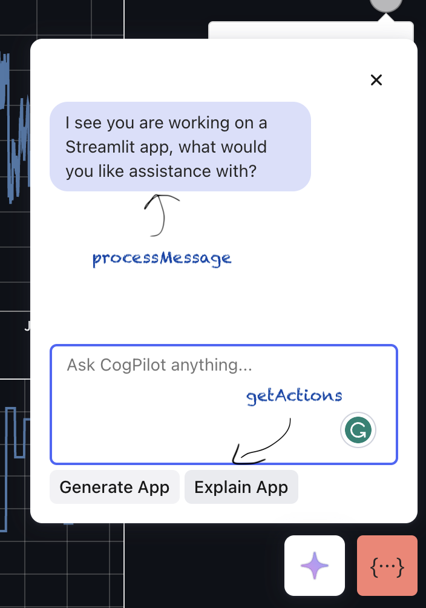
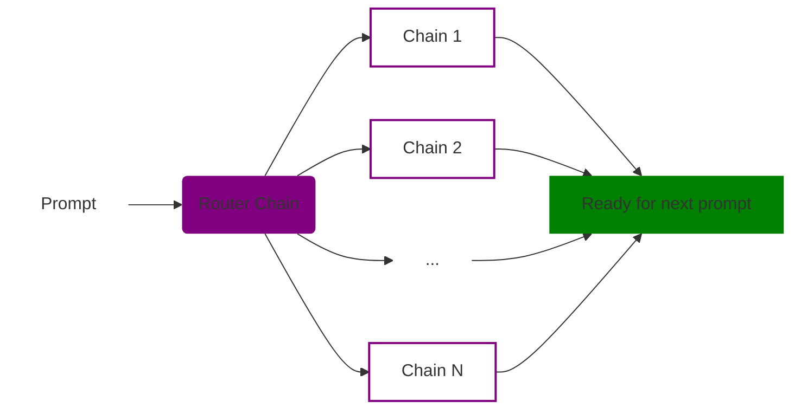
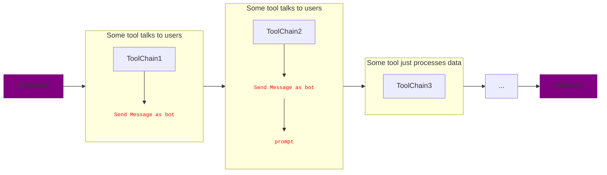
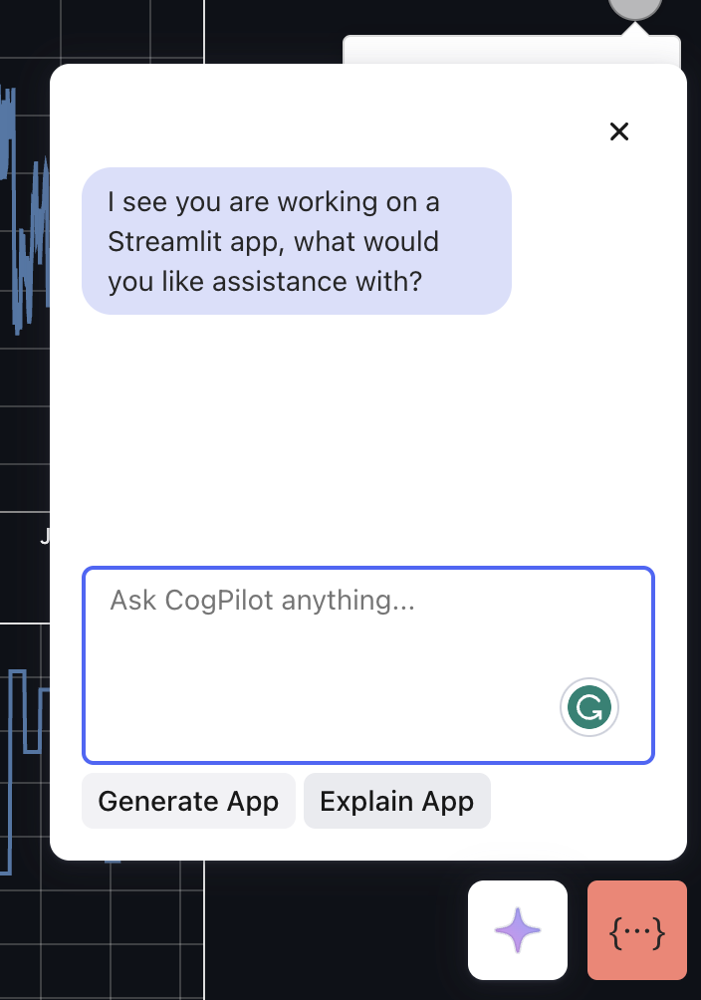

# @cognite/copilot-core

This is the core logic part of copilot, where both the UI and business logic lives. Most apps (ones in fusion) will not need to import the UI part, simply just need to update the business logic.

We will go over how the business logic works first, and UI second.

# Business logic part

For the Copilot, there are 3 categories of logic, both living in `src/lib`:

1. Chat bot flow - the UX of the chatbot and **how it interacts with the user**

2. Toolchains of the copilot - the backbone of the chat bot, where **each toolchain is a tool that the user have access to**. Each toolchain may need to communicate with the base application, thus:

3. Events - the **communication between the copilot and the base application.**

## 1. Chat bot flow



### `processMessage`

Given a message from the user, what should we reply and respond with.

- params:
  - `message`
  - `pastMessages`(includes the current `message` in the first parameter)
  - `async sendMessage()` - allows the bot to send a message to the user
- returns: `Promise<Boolean>`, should continue letting users do input or not.

> This process message by default will call the **router chain** as the main toolchain that identifies which tool to use to solve the identified user intent. More on this in next section

### `getActions`

Given the current list of messages, what are some recommended actions that the user can do.

- params:
  - `pastMessages`
  - async `sendMessage()`
- returns: `Promise<Actions[]>` - what buttons the user has access to for perfoming an action

Note: if the `pastMesages` are empty, assume you are starting the conversation with the user. Hence the sendMessage is super useful for giving context to the user, while the actions provide some quick ways to get started.

## 2. Toolchains

Toolchains are defined in `src/lib/toolchains`. The toolchains are categorized into different feature, but each can be "chained" to the result of another. How it works is as following:



and within each chain:



> The router chain is defined in `src/lib/toolchains/router/router.ts` and the most important chain - this gets triggered when we get a message from the user typically from `processMessage` and it will route the message to the correct toolchain.

To add a tool chain, simply:

1. Create a new toolchain in the `src/lib/toolchains` folder (under a feature group preferably), make sure the tool chain extends from `CogniteBaseChain`.
2. Code the chain, in here you have access to the sdk, the latest message and also the ability to communicate to the app or send message to the user via `ToCopilot.NEW_MESSAGES` **with the source as bot!** (more in the next section).
   > We recommend taking a look at the simple `appBuilder.ts` toolchain to get started.
3. Add the new toolchain in the `src/lib/toolchains/index.ts` file, and add it to the `ChainName` type with the literal of the name. and to
   `destinationChains` mapping between the name and the instantiated chain.
4. Watch the magic happen and give yourself a high five (or high five here 🖐️).

## 3. Communicating between Copilot <-> App

We communicate between the Copilot and the App via CustomMessage. We provide a variety of helpers for making this communication easy. To define these special events, there are 2 categories of events and event listener - `fromCopilot` and `toCopilot`, which intuitively describes event (or listening to events) that are "from" or "to" the Copilot.

These are defined in the [types](./src/lib/types.ts) file.

Let's walk through an example:

```typescript
type CopilotEvents = {
  FromCopilot: {
    // get all code from streamlit
    GET_CODE: null;
  };
  ToCopilot: {
    // get all code from streamlit
    GET_CODE: {
      content?: string;
    };
  };
};
```

**Copilot side**

Now, lets say in `processMessage` in Copilot, you want to trigger an event to get all the code, then you can do the following.

In this case, you want to add a way to listen for `GET_CODE` **from** the App, and then send a `GET_CODE` event **to** the App.

```typescript
// creates a listener for `GET_CODE_RESPONSE` from Copilot, we will use the returned function later
const removeEventListener = addToCopilotEventListener('GET_CODE', (event) => {
  // do something with the event.content code
  // ...

  removeEventListener();
});

// send the event to the App (from the Copilot) to trigger a response.
sendFromCopilotEvent('GET_CODE', null);
```

**App side**

You would do the inverse of the To/From but the same logic as above in the app. However, you can also use the provided hook builder - `createCopilotEventHandlerHooks`.

In this case you are listening to `GET_CODE` **from** the Copilot, and then sending a `GET_CODE` **to** the Copilot.

```typescript
// creates a handler for `GET_CODE_RESPONSE` from Copilot
const handler = useCallback(() => {
  sendToCopilotEvent('GET_CODE', {
    content: editorRef?.getModel()?.getValue(),
  });
});

// creates a listener for `GET_CODE` from Copilot
useFromCopilotEventHandler('GET_CODE', handler);
```

# UI part

`/src/app` contains all the code for the UI, which is divided in 2, the Button itself and the Chat UI.



Most uses of this fusion is not needed as the Button and Chat are globally mounted by the `@cognite/cdf-copilot` subapp (another `app` in this repo.).

The Button triggers the copilot via a CustomEvent via window. This means any other app can simply pass the same CustomEvent and trigger the open / closing of the Chat UI. This is also the way the Chatbot will communicate with other UIs on the screen.

However, this is needed for other non fusion apps to mount the copilot itself.

### How to use the UI aspect of the data model.

Simply import the `Copilot` component from the library and mount it. It expects a valid `sdk` (CogniteClient) and a `feature` name, which it needs to identify the business logic to run. We will go over this in the previous section.

Make sure to create a file like the following

```typescript
/* eslint-disable import/no-webpack-loader-syntax */

/**  This is the built in way how to load the web workers using webpack is with worker-loader */
import { loader } from '@monaco-editor/react';
import * as monaco from 'monaco-editor';
/**  This is the built in way how to load the web workers using webpack is with worker-loader */
import { Environment as MonacoEditorEnvironment } from 'monaco-editor';
import MonacoEditorWorker from 'worker-loader?esModule=true&inline=fallback!monaco-editor/esm/vs/editor/editor.worker?worker';

// point here so the context can be used
declare const self: any;

(self as any).MonacoEnvironment = {
  getWorker(_: string, _label: string) {
    // otherwise, load the default web worker from monaco
    return new MonacoEditorWorker();
  },
} as MonacoEditorEnvironment;

loader.config({ monaco });
```

and import it in the root.

Additionally, make sure to load in the styles!

```js
import 'highlight.js/styles/dracula.css';
import 'monaco-editor/dev/vs/editor/editor.main.css';
import 'react-resizable/css/styles.css';
import '@cognite/cogs.js/dist/cogs.css';
```

then

```js
import { Copilot } from '@cognite/copilot-core';
import { CogniteClient } from '@cognite/sdk';
...

const sdk = new CogniteClient({ appId: 'Copilot' });

export const SomeComponent = () => {
  return <Copilot feature={'Something'} sdk={sdk} />;
};
```

## Local dev

In fusion, you can just run `yarn nx serve copilot` and it will have copilot, which is a simple wrapper on this library.

To host build the library by itself, you can just run `yarn nx build copilot-core --with-deps --watch`. The `--watch` will allow NX to watch for changes and rebuild the library.

Also, for debugging add `--skip-nx-cache` if you want to make sure it is always building, and not loading from cache.

The output of the library will be at `dist/libs/@fusion/copilot-core` (NOT `dist/libs/copilot-core`). This is good to know as you can run `yarn link` from the library, and then `yarn link @cognite/copilot-core` from the app you want to use it in. This will allow you to use the locally built library from the app. To see how yarn link works, [check here](https://classic.yarnpkg.com/lang/en/docs/cli/link/).

> Important
> the correct location for the built copilot now is `dist/libs/@fusion/copilot-core` (NOT `dist/libs/copilot-core`).

### issues locally built library linking

Copilot is built in fusion, which is linked and imported from other apps (link from fusion, used in app), in these cases you may see errors for common libraries, like
`error: react hooks invalid` or `core-js not found`.

In these cases, the app you are running takes priority, and `fusion` side needs to respect the packages of your app.
You then would link `@cognite/sdk` and `monaco-editor` and `react` the opposite way - from your app to fusion. To do this, go to `node_modules/<package>` like `node_modules/@cognite/sdk` and run yarn link from the other repo (the app you are running copilot in), then in the fusion side (from the root folder `/fusion` NOT `/fusion/lib/copilot-core`), do `yarn link <package>`.

`yarn nx build copilot-core --watch` again

Note:

> Intel chips
> There is a potential issue with core-js, in which case, install core-js in the root of this repo / in the `libs/copilot-core`.

## Running unit tests

Run `yarn nx test copilot-core` to execute the unit tests via [Jest](https://jestjs.io).

## Running storybook

Run `yarn nx storybook copilot-core`
