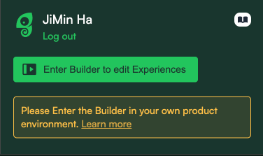

# @cognite/chameleon

This library was generated with [Nx](https://nx.dev).

## What is Chameleon?

Chameleon is a third party JS package that helps building onboarding user guides through its tour builder. You can read more about it here:

- Product: https://www.chameleon.io/
- Package: https://www.npmjs.com/package/@chamaeleonidae/chmln
- Code: https://github.com/chamaeleonidae/chmln
- Developer guide: https://developers.chameleon.io/#/

# How to get started

## Fusion subapps

This package is already included in the AuthContainer componenet from cdf-utilities library. No need to install anything.
If you want to build the onboarding flows, make sure to download the [chrome extension](https://chrome.google.com/webstore/detail/chameleon-builder/lfckcgkphfglcodbedlpkkkkjicbngpe) to get started. Open up the extension and click on `Enter Builder to edit Experiences`.
It should be pretty straightforward from there.



## Industry applications and other standalone applications

Add the `@cognite/chameleon` to your package.json file in your application. Then, wrap your application with `ChameleonProvider`.

As mentioned in the file `chamaeleonidae-chmln.d.ts`, we are working on contributing to `DefinitelyTyped` to make this process better. Once the contribution has been merged, you should be able to run the below shell command to add the missing types.

```sh
yarn add @types/chamaeleonidae__chmln
```

`ChameleonProvider` requires two props: UserInfo and project. Chameleon requires some information about the user to identify them properly.

```typescript
type UserInfo = {
  id: string;
  name: string;
  email: string;
};

type ChameleonProviderProps = {
  userInfo: UserInfo;
  project: string;
  children?: React.ReactNode;
};
```

We suggest that you write a wrapper for the provider to pass down the appropriate props. For example, take a look at the `ChameleonWrapper` in `cdf-utilities`. Every application has a different way of fetching the user information and the project name.

```typescript
import { PropsWithChildren } from 'react';

import { ChameleonProvider } from '@cognite/chameleon';
import { useQuery } from '@tanstack/react-query';

import { getUserInformation } from '@cognite/cdf-sdk-singleton';

import { getProject } from '../../utils';

const useUserInformation = () => {
  return useQuery(['user-info'], getUserInformation);
};

export const ChameleonWrapper: React.FC<PropsWithChildren> = ({ children }) => {
  const project = getProject();
  const { data: userInfo, isFetched } = useUserInformation();

  if (!isFetched || userInfo === undefined) {
    return <>{children}</>;
  }

  return (
    <ChameleonProvider
      project={project}
      userInfo={{
        id: userInfo.id,
        email: userInfo.mail || '',
        name: userInfo.displayName || '',
      }}
    >
      {children}
    </ChameleonProvider>
  );
};
```

After wrapping your app with the `ChameleonWrapper`, try enabling the chameleon chrome extension to build an onboarding tour.

## Running unit tests

Run `nx test chameleon` to execute the unit tests via [Jest](https://jestjs.io).
